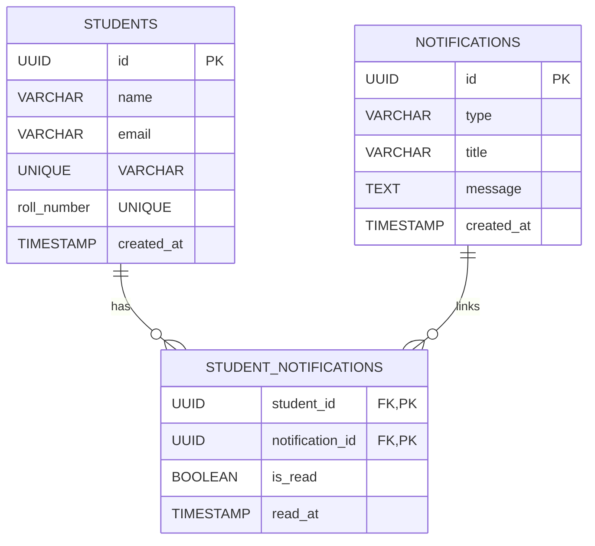
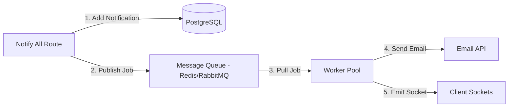

# Stage 1: API Design & Real-Time Notification Architecture

This section details the REST API design, contracts, and real-time mechanism for the Campus Notification System.

## 1. REST API Endpoints & Contracts

### A. Fetch Active Notifications
Retrieve a sorted, paginated list of notifications with optional category filtering.

* **Endpoint**: `GET /api/notifications`
* **Headers**:
  ```http
  Authorization: Bearer <JWT_Token>
  Accept: application/json
  ```
* **Query Parameters**:
  - `page` (integer, default: `1`): Current page.
  - `limit` (integer, default: `10`): Items per page.
  - `type` (string, default: `"All"`): Categories: `"All"`, `"Placement"`, `"Result"`, `"Event"`.
* **Response (200 OK)**:
  ```json
  {
    "notifications": [
      {
        "id": "d146095a-0d86-4a34-9e69-3900a14576bc",
        "type": "Result",
        "title": "Mid-Semester Examination Schedule",
        "message": "The mid-semester exam dates have been published.",
        "timestamp": "2026-04-22T17:51:30.000Z",
        "read": false
      }
    ],
    "totalPages": 5,
    "totalCount": 48
  }
  ```

### B. Get Unread Notifications Count
Retrieve the count of unread notifications for the student.

* **Endpoint**: `GET /api/notifications/unread-count`
* **Headers**:
  ```http
  Authorization: Bearer <JWT_Token>
  Accept: application/json
  ```
* **Response (200 OK)**:
  ```json
  {
    "unreadCount": 12
  }
  ```

### C. Mark Notification as Read
Flag a specific notification as viewed by the user.

* **Endpoint**: `PATCH /api/notifications/:id/read`
* **Headers**:
  ```http
  Authorization: Bearer <JWT_Token>
  Content-Type: application/json
  ```
* **Response (200 OK)**:
  ```json
  {
    "success": true,
    "notificationId": "d146095a-0d86-4a34-9e69-3900a14576bc",
    "markedReadAt": "2026-06-26T06:50:00.000Z"
  }
  ```

---

## 2. Real-Time Notification Mechanism
To deliver notifications instantly without standard polling, we propose a **WebSockets** architecture using **Socket.io**:

1. **Persistent Connection**: When a student logs in, the React client establishes an open, persistent TCP connection with the WebSockets server (`ws://localhost:5000/notifications`).
2. **Channel Subscription**: Upon connection, the server registers the socket into a room matching the student's unique ID (e.g., `room:student_1042`).
3. **Event Emmission**: Whenever an external system publishes a notification:
   - The server inserts the record into the database.
   - The server pushes a `notification:new` event carrying the JSON payload directly to the student's socket room:
     ```javascript
     io.to(`room:student_${studentId}`).emit('notification:new', newNotificationPayload);
     ```
   - The frontend intercepts this socket event, appends the new item to the active state list, and increments the unread badge count immediately.

---
---

# Stage 2: Database Storage Selection & Schema Design

This section details the database choice, relational schema, and scalability optimizations.

## 1. Storage Choice: PostgreSQL (Relational SQL)
We select **PostgreSQL** over NoSQL solutions (like MongoDB) for the following reasons:
* **Relational Nature of Data**: Notifications have clear relationships (each student has a state—read or unread—for each notification, representing a classic many-to-many relationship).
* **Strict Schema & Consistency**: Academic and placement alerts must be reliable. We require ACID transactions to guarantee that notifications are never lost or misassigned.
* **Join Capability**: Fetching unread notifications requires joining the notification metadata table with the student's read-status join table, which SQL database engines optimize using index-assisted nested loops.

---

## 2. Relational Database Schema



### SQL Table Schema Definitions
```sql
CREATE TYPE notification_type AS ENUM ('Placement', 'Result', 'Event');

CREATE TABLE students (
    id UUID PRIMARY KEY DEFAULT gen_random_uuid(),
    name VARCHAR(100) NOT NULL,
    email VARCHAR(150) UNIQUE NOT NULL,
    roll_number VARCHAR(50) UNIQUE NOT NULL,
    created_at TIMESTAMP WITH TIME ZONE DEFAULT CURRENT_TIMESTAMP
);

CREATE TABLE notifications (
    id UUID PRIMARY KEY DEFAULT gen_random_uuid(),
    type notification_type NOT NULL,
    title VARCHAR(200) NOT NULL,
    message TEXT NOT NULL,
    created_at TIMESTAMP WITH TIME ZONE DEFAULT CURRENT_TIMESTAMP
);

CREATE TABLE student_notifications (
    student_id UUID REFERENCES students(id) ON DELETE CASCADE,
    notification_id UUID REFERENCES notifications(id) ON DELETE CASCADE,
    is_read BOOLEAN DEFAULT FALSE NOT NULL,
    read_at TIMESTAMP WITH TIME ZONE,
    PRIMARY KEY (student_id, notification_id)
);
```

---

## 3. High-Volume Scaling Problems & Solutions
As the notification volume increases (e.g. 5,000,000 rows):

| Problem | Explanation | Solution |
| :--- | :--- | :--- |
| **Slow Pagination Queries** | Finding unread notifications using `OFFSET` triggers full index scans. | **Keyset Pagination**: Sort by `created_at` and query where `created_at < last_seen_timestamp` instead of offsetting records. |
| **Join Table Bloat** | `student_notifications` grows linearly: `50,000 students * 5,000 notifications = 250,000,000 records`. | **Table Partitioning**: Partition the join table by month or year using declarative PostgreSQL partitioning on the `created_at` field. |
| **Write Amplification** | Fast notification generation slows down due to real-time index updates. | **Read-Write Splitting**: Route write requests to a primary master instance and query reads from read-only replicas. |

---

## 4. SQL Queries for APIs

### A. Fetch Unread Notifications (Paginated)
```sql
SELECT n.id, n.type, n.title, n.message, n.created_at, sn.is_read
FROM student_notifications sn
JOIN notifications n ON sn.notification_id = n.id
WHERE sn.student_id = '1042-uuid-here'
  AND sn.is_read = FALSE
ORDER BY n.created_at DESC
LIMIT 5 OFFSET 0;
```

### B. Mark Notification as Read
```sql
UPDATE student_notifications
SET is_read = TRUE, read_at = NOW()
WHERE student_id = '1042-uuid-here'
  AND notification_id = 'notif-uuid-here';
```

### C. Fetch Unread Count
```sql
SELECT COUNT(*) AS unread_count
FROM student_notifications
WHERE student_id = '1042-uuid-here'
  AND is_read = FALSE;
```

---
---

# Stage 3: Query Tuning & Indexing Strategy

This section covers optimization of database indices and query planning.

## 1. Query Evaluation: `SELECT * FROM notifications WHERE studentID = 1042 AND isRead = false ORDER BY createdAt ASC;`

* **Is this query accurate?** 
  - Yes, it is syntax-accurate assuming a simplified "flat" table design where notifications are stored in a single table per student. However, in production-grade systems, a normalized design separating notifications and read states (as designed in Stage 2) is preferred to avoid text bloat.
* **Why is it slow?**
  1. **Full Table Scan (Sequential Scan)**: Without an index, the engine must scan all 5,000,000 records to filter by `studentID = 1042` and `isRead = false`.
  2. **Disk-Based External Sort**: The query orders results by `createdAt ASC`. Without an index on this column, the engine must sort the filtered subset in memory or write temporary files to disk if the subset exceeds RAM buffer allocations.

---

## 2. Optimization Solution: Composite Index
We should create a **composite (compound) index** covering all fields in the `WHERE` and `ORDER BY` clauses:

```sql
CREATE INDEX idx_notifications_student_unread_sort 
ON notifications (studentID, isRead, createdAt ASC);
```

### Why is this effective?
* The database engine performs a binary tree lookup (`O(log N)` complexity) to pinpoint records matching `studentID` and `isRead`.
* Since the index nodes are pre-ordered by `createdAt ASC`, the database completely skips the sorting phase (cost drops to `O(1)` for sorting).

---

## 3. Evaluation of Adding Indexes to Every Column
**Adding indexes to every column is a dangerous anti-pattern**. 

### Why/Why not?
1. **Severe Write Degradation**: Every `INSERT`, `UPDATE`, and `DELETE` must rebuild all affected indices. This turns fast insert operations into high-latency blocking writes.
2. **Storage and RAM Bloat**: Indexes are stored in memory to remain fast. Indexing all columns will consume massive amounts of RAM, displacing the query cache and causing pages to swap to disk.
3. **Query Optimizer Degradation**: If there are too many candidate indexes, the query optimizer takes longer to compute the execution plan, and might select suboptimal indexes.

---

## 4. Query: Placement Notifications in Last 7 Days
```sql
SELECT DISTINCT studentID
FROM notifications
WHERE notificationType = 'Placement'
  AND createdAt >= NOW() - INTERVAL '7 days';
```

---
---

# Stage 4: High-Throughput Fetch Optimization & Caching

This section describes caching topologies to prevent database exhaustion on concurrent page mounts.

## Caching Strategy Architectures

### 1. In-Memory Session Caching (Redis)
We place a **Redis cache** in front of the PostgreSQL database:
- **Key Schema**: `student:notif_count:<studentID>` (stores unread count) and `student:notif_page1:<studentID>` (stores JSON of page 1).
- **TTL (Time to Live)**: 1 hour.
- **Eviction / Invalidation**: Evicted on writing events. When `POST /api/notifications` is called or a notification is read, we delete/update the keys.

### 2. HTTP Conditional Headers (`ETag` / `Last-Modified`)
- **Action**: When a client requests notifications, the server computes a cryptographic hash of the user's notification list and returns it in the `ETag` header.
- **Subsequent Requests**: The client sends `If-None-Match: <hash>`. If the list hasn't changed, the server returns a `304 Not Modified` status code, completely avoiding JSON serialization and network transfer.

---

## Performance Tradeoffs

| Strategy | Advantages | Disadvantages |
| :--- | :--- | :--- |
| **Redis Cache** | - Sub-millisecond response times.<br>- Reduces database load to zero for repeat page loads. | - **Cache Invalidation Complexity**: Must write code to carefully evict keys whenever notifications are added or read to avoid stale data. |
| **HTTP Conditional Headers** | - Reduces network bandwidth.<br>- Zero client-side parsing costs for unchanged data. | - The server must still hit the database or cache to verify the current list hash, so it doesn't completely eliminate server execution. |
| **Frontend State/Local Cache** | - Zero network calls when toggling tabs.<br>- Smooth user experience. | - Student will not see new notifications unless they manually trigger a refresh or a socket push occurs. |

---
---

# Stage 5: Notify All Decoupled Architecture

This section critiques the synchronous implementation and proposes an asynchronous system.

## 1. Shortcomings of the Synchronous Pseudocode
1. **Blocking Call Stack**: Loop processes 50,000 users sequentially. If each iteration takes 100ms (combining DB write, email SMTP handshakes, and socket pushes), the total execution time will be **83 minutes**. The client HTTP request will timeout long before completion.
2. **Zero Fault Tolerance**: If the email server fails at student `25,000`, the execution halts. There is no state tracking showing which students successfully received the notice, leading to duplicate emails or skipped users.
3. **No Retries**: Failed API calls (like the 200 failed midway) are simply dropped without retrying.

---

## 2. Reliable Redesign using Message Queues (BullMQ / RabbitMQ)

We decouple the operation using a publisher-subscriber model:



### Should Database Write and Email Sending Happen Together?
**No**. Database writes are fast and local. Email delivery depends on network availability and third-party SMTP servers, which are slow and fail frequently. Decoupling ensures that a slow/failed email service never blocks or rollbacks local database transactions.

---

## 3. Revised Pseudocode

### Publisher (Express Handler)
```javascript
async function handleNotifyAll(req, res) {
  const { title, message, type } = req.body;
  
  // 1. Insert notification metadata once
  const notif = await db.insertNotification({ title, message, type });
  
  // 2. Fetch all student IDs
  const studentIds = await db.getAllStudentIds();
  
  // 3. Batch enqueue individual job payloads
  const jobs = studentIds.map(studentId => ({
    name: 'send-notification',
    data: { studentId, message, notifId: notif.id }
  }));
  
  await notificationQueue.addBulk(jobs);
  
  // Return immediate response (Non-blocking)
  res.status(202).json({ success: true, message: "Notification broadcast enqueued." });
}
```

### Worker Process (Queue Consumer)
```javascript
notificationQueue.process('send-notification', async (job) => {
  const { studentId, message, notifId } = job.data;
  
  // 1. Save read state record for student
  await db.saveStudentNotificationState(studentId, notifId);
  
  // 2. Push to App WebSockets (non-blocking)
  try {
    await pushToApp(studentId, message);
  } catch (err) {
    Log('backend', 'error', 'middleware', `Socket push failed for student ${studentId}: ${err.message}`);
  }

  // 3. Send Email with built-in retry parameters
  try {
    await sendEmail(studentId, message);
  } catch (err) {
    Log('backend', 'warn', 'service', `Email failed for student ${studentId}. Triggering retry.`);
    throw err; // Throwing error triggers automatic queue retry logic
  }
});
```

---
---

# Stage 6: Priority Inbox Sorting Algorithm

This section explains the ranking algorithm and execution details for the Priority Inbox.

## 1. Sorting Algorithm & Weights
To determine the importance of notifications, we assign weight integers to the types:
- **Placement**: `Weight = 3` (Highest)
- **Result**: `Weight = 2`
- **Event**: `Weight = 1` (Lowest)

### Scoring Function
$$\text{Score} = (\text{Weight} \times 10^{10}) + \text{Timestamp (Unix Epoch seconds)}$$

This mathematically guarantees that **Placement** notices are sorted above **Result** and **Event** notices, while sub-sorting notices of the same type by recency.

---

## 2. Efficient Maintenance of Top 10
When new notifications arrive continuously:
- **Min-Heap Approach**: Instead of sorting the list on each event ($O(N \log N)$), we maintain a **Min-Heap** of size $K = 10$.
- **Insertion logic**:
  - For each incoming notification, compute its score.
  - If the heap has fewer than 10 items, push the notification ($O(\log K)$).
  - If the heap has 10 items, compare the new notification's score with the minimum score in the heap (root).
  - If the new score is greater than the root, pop the root and push the new item ($O(\log K)$).
  - Using this approach, the time complexity per incoming notification is **$O(\log 10) = O(1)$**, making it extremely fast.
